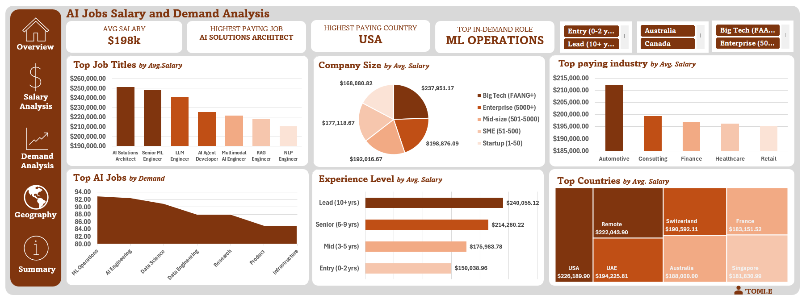

# AI Jobs Salary & Demand Analysis — 2025/2026

> **Tool:** Microsoft Excel (Pivot Tables, Charts, Dashboard)
> **Type:** Labour Market Analysis | Salary Intelligence | Demand Mapping
> **Dataset:** 1,500 AI job market records | 14 countries | 25 job titles | 12 industries

## The Question This Project Answers

The AI job market is growing fast — but what does the data actually say?
Where are salaries highest? Which roles are most in demand? Does your
employer's size affect your pay more than your experience? This dashboard
was built to cut through the noise with real numbers.

---

## Dataset Overview

| Field | Detail |
|---|---|
| Records | 1,500 job postings |
| Countries | 14 |
| Job Titles | 25 |
| Industries | 12 |
| Experience Levels | 4 (Entry → Lead) |
| Company Size Types | 5 (Startup → Big Tech) |
| Key Metrics | Annual salary (USD), Demand score, YoY demand growth % |

Fields included: Job ID, Job Title, Category, Experience Level,
Years of Experience, Education Required, Annual Salary (USD),
Salary Min/Max, City, Country, Remote Work Type, Company Size,
Industry, Required Skills, AI Salary Premium %, Demand Score,
Demand Growth YoY %, Benefits Score, Posting Year/Month

---

## Steps Taken

1. **Data Familiarisation** — Explored 25 columns across 1,500 rows.
   Identified salary, demand score, and demand growth as the three
   central metrics for analysis
2. **Data Cleaning** — Verified salary ranges, standardised experience
   level categories, and confirmed country and company size fields
   were consistent across all records
3. **Pivot Table Analysis** — Built six pivot tables covering:
   - Average salary by job title
   - Average salary by experience level
   - Average salary by company size
   - Average salary by country
   - Average salary by industry
   - Average demand score by job category
4. **Dashboard Design** — Combined all six charts into one interactive
   dashboard with four KPI summary cards and slicers for experience
   level, country, and company size filtering

---

## Key Numbers

| Metric | Finding |
|---|---|
| Average AI Salary | $198K |
| Highest Paying Role | AI Solutions Architect — $251K avg |
| Lowest in Top 7 | NLP Engineer — $211K avg |
| Entry Level Average | $150K |
| Lead Level Average | $240K |
| Experience Premium | +$90K from Entry to Lead |
| Big Tech vs Startup Gap | $238K vs $168K — $70K difference |
| Top Paying Country | USA — $226K avg |
| Remote Work Average | $222K avg |
| Most In-Demand Role | ML Operations — demand score 93 |
| Avg YoY Demand Growth | 31.12% across all roles |
| Top Paying Industry | Automotive — $212K avg |

---

## What the Data Revealed

### Salary by Role
AI Solutions Architect ($251K) and Senior ML Engineer ($248K) sit
at the top — both exceeding $240K on average. Even the lowest-ranked
role in the top 7, NLP Engineer, averages $211K. The floor for
specialised AI roles is remarkably high.

### The Experience Ladder
Every experience tier commands a meaningful salary jump:
Entry ($150K) → Mid ($176K) → Senior ($214K) → Lead ($240K).
The biggest single jump is from Mid to Senior — a $38K leap.

### Company Size Effect
Big Tech (FAANG+) pays $238K on average — $70K more than startups
($168K). This is one of the most significant salary variables in
the dataset, often more impactful than geography alone.

### Geography
The USA leads at $226K. Remote roles globally average $222K —
a near match — suggesting location is becoming less of a salary
determinant for remote-friendly AI roles. UAE, Switzerland,
and Australia cluster around $188K–$194K.

### Demand Landscape
ML Operations (93), AI Engineering (92.6), and Data Science (91)
lead the demand rankings. With an average YoY demand growth of
31% across all categories, the market is not plateauing —
it is accelerating.

### Industry Surprise
Automotive edges out Consulting and Finance as the top-paying
industry at $212K average — a finding that reflects the heavy
AI investment in autonomous vehicles and smart manufacturing.

---

## Recommendations (Career-Focused)

- **Target AI Solutions Architect or Senior ML Engineer** if
  maximising salary is the goal — both average above $247K
- **Pursue Big Tech opportunities** where possible — the $70K
  company-size premium is too large to ignore without a
  strategic reason
- **Consider remote roles** — at $222K average they nearly
  match US-based salaries while offering geographic flexibility
- **Invest in experience progression** — the Mid-to-Senior
  jump ($38K) offers the best return per career stage
- **Watch the Automotive sector** — it is currently outpaying
  Finance and Consulting for AI talent, suggesting strong
  and sustained demand

---

## Dashboard Preview

## About
Built by **Oluwatomisin Odeyale**
Connect on [LinkedIn](https://www.linkedin.com/in/oluwatomisin-odeyale-54631a2a8?utm_source=share&utm_campaign=share_via&utm_content=profile&utm_medium=android_app)
